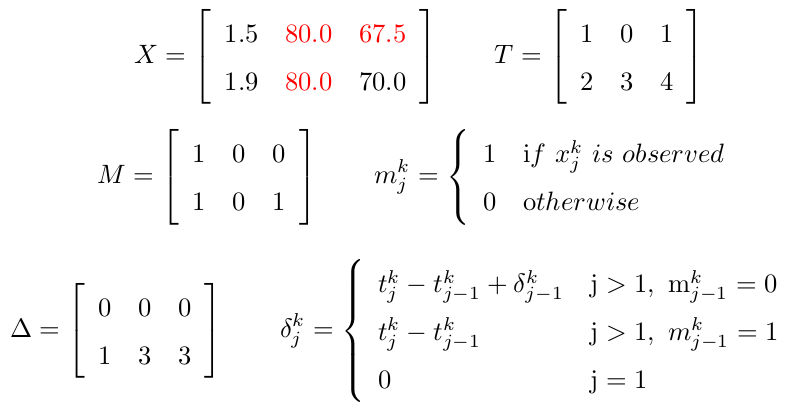
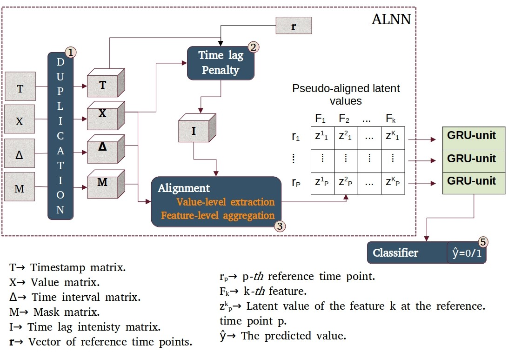
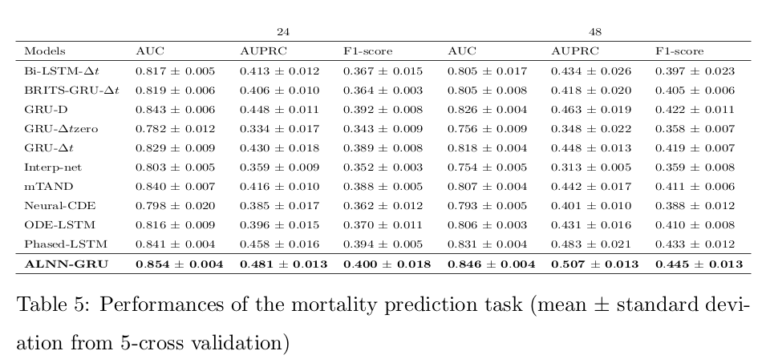

# ALNN-GRU
As RNN models are designed for regular time series data, feeding them with irregular data can significantly reduce their performance. To overcome this drawback, we build an Alignment-driven Neural Network (ALNN) on top of an RNN model. The ALNN is a deep neural network that transforms irregular multivariate time series data into pseudo-aligned latent data. This pseudo-aligned latent data, acting as regular multivariate time series data, can then be fed into the RNN model.

# Data description
$X$->Observed and imputed values (the red values are the imputed values), $T$->timestamps, $M$->masks, $\Delta$->time variation across each channel.
A verbal explanation of of $X,T,M$ and $\Delta$ with an example could be: the first value of the variable $k=1$, $x^1_1=1.5$, is a non inputted value $m^1_1=1$, observed at the timestamp $t^1_1=1$. The time interval between $x^1_1=1.5$ and $x^1_2=1.9$ is $\delta^1_2=1$.



# Architecture


# Requirement
```
tensorflow==2.9.2
pandas==1.3.0
tqdm
seaborn
scikit-learn
```

# Steps to follow to launch the model
1. As we are not allowed to share the data, the user must first complete an ethics course and get the MIMIC-3 database from https://physionet.org/content/mimiciii/1.4/ and place it in the data directory. The user must unzip the following files: CHARTEVENTS.csv.gz, OUTPUTEVENTS.csv.gz, ICUSTAYS.csv.gz and D_ITEMS.csv.gz.
2. Run Features_selection.py to extract data for selected features in the study
```
python3 features_selection.py 
```
2. Run data_cleaning.py to replace outliers by nan. --prior-hours is in [24,48]
```
python3 data_cleaning.py --prior-hours 24
```
2. Run data_imputation.py to to impute outliers and initial missing values (i.e. not due to time irregularity).
```
python3 data_cleaning.py --prior-hours 24
```
3. Run samples_preparation.py to get the imput and target samples.
```
python3 samples_preparation.py --prior-hours 24
```
3. Run train.py to train the model. The time-ref-parameter set the reference time point vector. If: time-ref-parameter=1, Δr=1./time-ref-parameter=2, Δr=0.5/time-ref-parameter=3, Δr=0.33/time-ref-parameter=4, Δr=0.25/
```
python3 train.py --prior-hours 24 --ref-time-parameter 1 --batch-size 2000
```
# Results 

